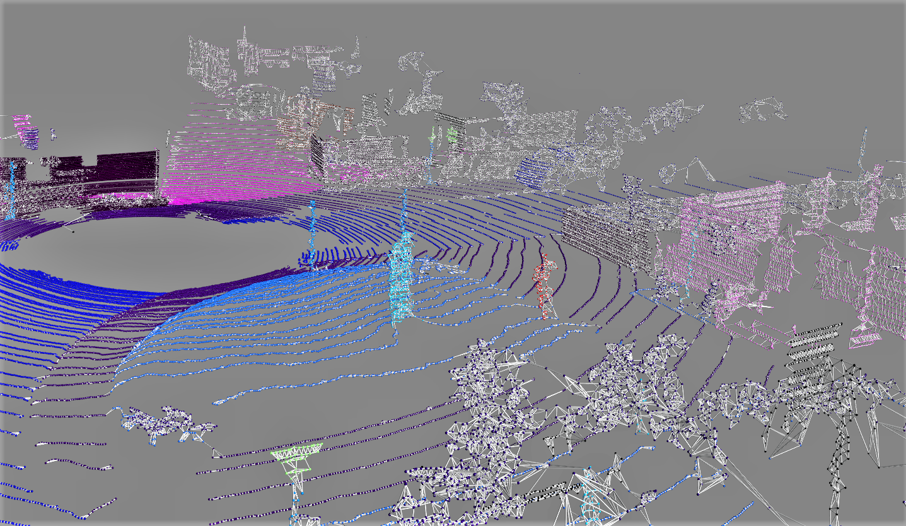
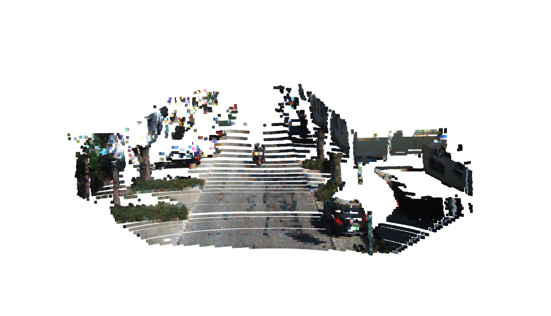

# GraphPC

Semantic segmentation of LiDAR point clouds using Graph Convolutional Networks and a projection-based LiDAR-Camera data fusion algorithm.
The model, dubbed as PointSegGCN, is trained and tested on SemanticKITTI's annotated point clouds, fused with RGB information rendered from the KITTI Visual Odometry Benchmark.

# Table of Contents

-  [In a Nutshell](#in-a-nutshell)
-  [Graph-based Learning](#graph-based-learning)
-  [Multimodal Approach](#multimodal-approach)
-  [Setup](#setup)
-  [Current Progress](#current-progress)

# In a Nutshell

Semantic segmentation of point clouds aims to assign a category label to each point. Due to the lack of order in 3D points, a point cloud with N 3D points has a total of N! possible permutations in the data feeding order. Hence, it is important for a network to maintain invariance of all possible permutations. Since Graphs are deemed useful to efficiently represent non-Euclidean data, they draws parallels with the way point clouds could be represented. The approach in this git proposes a way to not only perform learning on graph-structured representations of LiDAR point clouds, but also integrates a novel pre-processing pipeline which facilitates the implementation of a multimodal segmentation architecture.  

# Graph-based learning

A Graph is data represented in the form
<p align="center">

</p>

where V and E are the vertices (the datapoints themselves) and the edges (the quantized relations between the datapoints) respectively.
A graph is numerically represented by an *adjacency matrix*, whose rows and columns correspond to the total number of nodes/vertices present in the data, appropriately filled with values wherever edges are present between nodes. In this git, each sample point cloud is represented by a graph whose nodes are the points (node features being XYZ coordinates and possibly associated RGB values). The edge values are computed by running a KD-tree Nearest Neighbour search algorithm. 

A visualized example is shown below, from an example SemanticKITTI LiDAR scan:

<p align="center">

</p>

Graphs however, cannot be processed by such traditional CNNs due to their irregular non-Euclidean structure (more abstract). However, T. N. Kipf and M. Welling (2017) proposed a graph-based counterpart to the CNN, termed Graph Convolutional Networks (GCN).
A single GCN layer performs the following computation:

<p align="center">

</p>

where A is the Adjacency Matrix, D the node degree matrix and X is the feature matrix. The proposed model tries to incorporate Graph Convolution layers in an architecture with skip connections.

# Multimodal Approach

A proven way to enhance network performance is to augment each datapoint's feature vector.This ensures that the model extracts more relevant information from the data to facilitate more accurate semantic labeling on test data. Additional information input to a network is called a *modality*. From the SemanticKITTI dataset, there exists two possible modalities associated with each scan: *geometric data* (point cloud XYZ coordinates) and *colour data* (RGB information present in images captured). In this git, a multimodal approach to semantic segmentation is implemented by fusing the LiDAR geometric data with RGB information.

This invokes the ```SensorFusion()``` class, where the camera calibration parameters are obtained and used to compute a velodyne-to-camera projection matrix, and subsequently perform a mapping of the LiDAR points within the Camera FOV to their respective RGB values. An example of such an 'augmented' point cloud is shown below: 
<p align="center">

</p>

# Setup

* Clone the repository
  
  ``` git clone https://github.com/sidbab94/GraphPC.git .```
  
* Setup python environment (Python >= 3.7 recommended)

  ``` python3 venv pcgcn ``` and ``` source bin/activate ```
 
* Install packages

  ``` pip install -r requirements.txt ```
 
# Test

Run ``` python infer.py ``` to perform inference on sample LiDAR scan data.

# Current Progress

| Network | mIoU | Avg. Inference Time (ms)
| ------------ | ------------- | -------------
| [PointSegGCN_v1](models/summaries/PointSegGCN.txt) | 16.4 | 291
