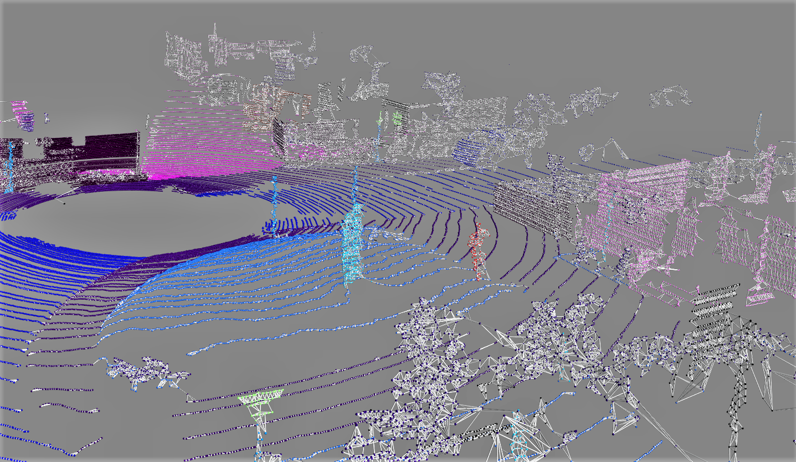

# GraphPC

Semantic Segmentation of Graph-based representations of LiDAR point clouds (from the  SemanticKITTI [dataset](http://www.semantic-kitti.org/dataset.html)), using Tensorflow and the Spektral API.

# Table of Contents

-  [In a Nutshell](#in-a-nutshell)
-  [A bit about Graphs](#a-bit-about-graphs)
    -  [Graph Representation](#graph-representation)
    -  [Graph Convolutional Networks](#graph-convolutional-networks)

# In a Nutshell

Semantic segmentation of point clouds aims to assign a category label to each point. In order to implement any sort of network architecture that is purposed to do so, it must take into account, above all, the unordered nature of point clouds. Due to the lack of order in 3D points, a point cloud with N 3D points has a total of N! possible permutations in the data feeding order. Hence, it is important for a network to maintain invariance of all possible permutations. Since Graphs are deemed useful to efficiently represent non-Euclidean data, they draws parallels with the way point clouds could be represented. Hence, it only makes intuitive sense to design and implement a neural network architecture that centers around large-scale point clouds reimagined as graphs.

# A bit about Graphs

## Graph Representation

Vast majority of deep learning performed on structured Euclidean Data, e.g. images, text, audio, etc. 
Non-Euclidean data can represent more complex items, such as molecules, point clouds, etc. (do not fit into 2-dimensional space). Representing non-Euclidean data efficiently allows one to prioritize the model to learn certain patterns by changing the structure of the data. A prime example of non-Euclidean data representation is a Graph.

A Graph is data represented in the form

where V and E are the vertices (the datapoints themselves) and the edges (the quantized relations between the datapoints) respectively. 

To represent a graph, one requires the set of vertices, and for each vertex the neighbours of the vertex (directly connected by an edge). An *Adjacency Matrix* is commonly used to represent a graph. It consists of rows and columns, both corresponding to the total number of nodes/vertices present in the data, appropriately filled with values wherever edges are present between nodes. For example:

Extending this principle to point clouds, one can intuitively imagine the points themselves to be vertices/nodes and the edges to be (possibly) the Euclidean distances between the points. For instance, edges can be drawn between points and their k closest neighbours (found using KD-Tree partioning technique), from which a weighted adjacency matrix and subsequently a graph can be constructed (as shown in the SemanticKITTI example scan below).

## Graph Convolutional Networks

A traditional Convolutional Neural Network consists of 3 main operations: 
- Kernel – A "scanner" that processes the image in clusters of pixels, defined by the user – aggregates pixels into values in grid format 
- Pooling – A kernel that extracts the most important values, used to construct a grid of values for flattening 
- Flattening – Truncation operation on final grid structure to an array, that can be put through a neural network, which finally outputs a prediction 

Graphs however, cannot be processed by such traditional CNNs due to their irregular non-Euclidean structure (more abstract). However, T. N. Kipf and M. Welling (2017) proposed a graph-based counterpart to the CNN, termed Graph Convolutional Networks (GCN).
A single GCN layer performs the following computation:

where A is the Adjacency Matrix, D the node degree matrix and X is the feature matrix.
