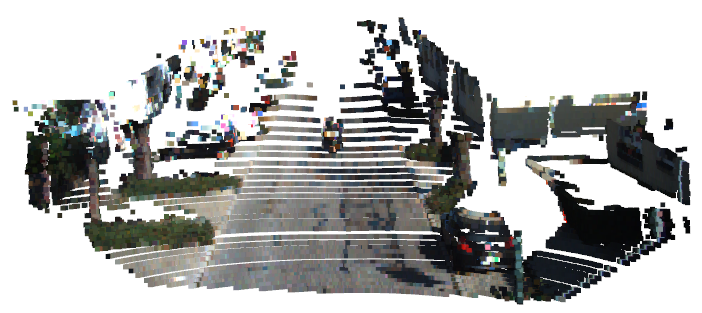

# GraphPC

Multimodal Semantic Segmentation of Graph-based representations of LiDAR point clouds (from the  SemanticKITTI [dataset](http://www.semantic-kitti.org/dataset.html)), using Tensorflow and the Spektral API.

# Table of Contents

-  [In a Nutshell](#in-a-nutshell)
-  [Graph-based Learning](#graph-based-learning)
-  [Multimodal Approach](#multimodal-approach)
-  [Current Progress](#current-progress)

# In a Nutshell

Semantic segmentation of point clouds aims to assign a category label to each point. Due to the lack of order in 3D points, a point cloud with N 3D points has a total of N! possible permutations in the data feeding order. Hence, it is important for a network to maintain invariance of all possible permutations. Since Graphs are deemed useful to efficiently represent non-Euclidean data, they draws parallels with the way point clouds could be represented. The approach in this git proposes a way to not only perform learning on graph-structured representations of LiDAR point clouds, but also integrates a novel pre-processing pipeline which facilitates the implementation of a multimodal segmentation architecture.  

# Graph-based learning

A Graph is data represented in the form
<p align="center">

</p>

where V and E are the vertices (the datapoints themselves) and the edges (the quantized relations between the datapoints) respectively.
A graph is numerically represented by an *adjacency matrix*, whose rows and columns correspond to the total number of nodes/vertices present in the data, appropriately filled with values wherever edges are present between nodes. In this git, each sample point cloud is represented by a graph whose nodes are the points (node features being XYZ coordinates and possibly associated RGB values). The edge values are computed by running a KD-tree Nearest Neighbour search algorithm. This is achieved by running:

``` cd preproc_utils ``` and then ```python graph_gen.py```

A visualized example is shown below, from an example SemanticKITTI LiDAR scan:

<p align="center">

</p>

# Multimodal Approach

A proven way to enhance network performance is to augment each datapoint's feature vector.This ensures that the model extracts more relevant information from the data to facilitate more accurate semantic labeling on test data. Additional information input to a network is called a *modality*. From the SemanticKITTI dataset, there exists two possible modalities associated with each scan: *geometric data* (point cloud XYZ coordinates) and *colour data* (RGB information present in images captured). In this git, a multimodal approach to semantic segmentation is implemented by fusing the LiDAR geometric data with RGB information. This is achieved by running:

``` cd preproc_utils ``` and then ```python sensor_fusion.py```

This invokes the ```SensorFusion()``` class, where the camera calibration parameters are obtained and used to compute a velodyne-to-camera projection matrix, and subsequently perform a mapping of the LiDAR points within the Camera FOV to their respective RGB values. An example of such an 'augmented' point cloud is shown below: 
<p align="center">

</p>

# Current Progress

| Date | Network | mIoU | Avg. Inference Time (s)
| ------------ | ------------ | ------------- | -------------
| 13.01.2021 | [Res_GCN_v1](Res_GCN_v1_summary.txt) | 14.45 | 0.742
